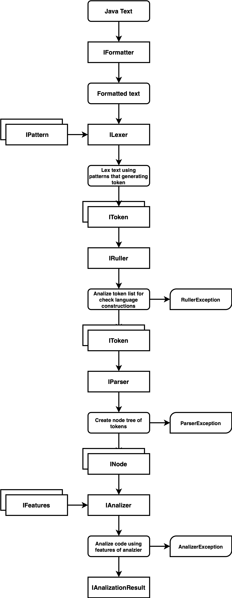

# Null Safety Linter

Null safety static analizer (linter) for java language.

# How Use

Открой и пой.

# Support

- [x] Formatter
  - [x] Remove comments
- [x] Lexer
  - [x] Lex single file
  - [x] Lex single simple parts of code
- [ ] Patterns (lexer)
  - [x] Symbols patter
    - [x] \>
    - [x] \<
    - [x] \=
    - [x] \>=
    - [x] \<=
    - [x] \==
    - [x] \!=
    - [x] \:
    - [x] \.
    - [x] \;
    - [x] \+
    - [x] \*
    - [x] \/
    - [x] \{
    - [x] \}
    - [x] \)
    - [x] \(
    - [x] \@
  - [ ] Keywords patter
    - [x] if
    - [x] else
    - [x] new
    - [x] return
    - [x] switch
    - [x] case
    - [x] default
    - [x] break
    - [ ] class
    - [ ] this
    - [ ] base types, like int, string
  - [x] Literals Pattern
    - [x] int (1, 323)
    - [x] double (1.323, 323.234)
    - [x] char (' ', 't')
    - [x] string ("test")
  - [x] Types Pattern
  - [x] Names Pattern
- [ ] Rules (lexer)
  - [ ] If rule
- [ ] Parser
- [ ] Static analyzer
- [ ] Features (analyzer)
  - [ ] NullSafe features

# Architecture

This is planed architecture.

#

All rights reserved.

Developed by [@femboy-dev](https://github.com/femboy-dev).
