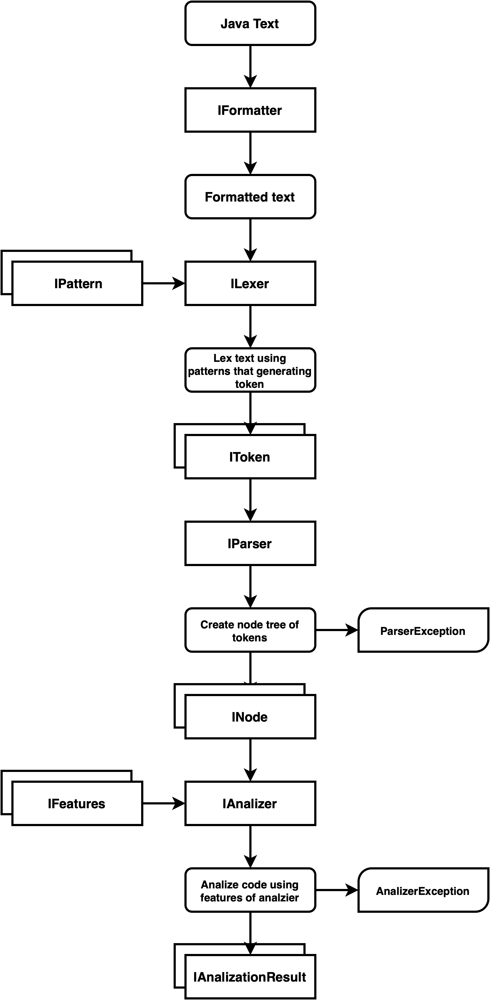

> Я решил написать свой парсер, потому что мне это было очень интересно. 
> Но я не успел дописать if/else, switch, import и class. 
> И не успел покрыть парсер и анализатор тестами.
> 
> Я шел по графику, но вроде в четверг началась война в Украине, а я от туда и дня 3 просто был с
> родителями постоянно на связи и еще помогал им с некоторыми делами. 
> 
> Из-за этого я не успел добавить эти поддержки в задание.
> 
> В целом то что есть работает. Я еще хотел задокументировать код и добавить поддержку

# Null Safety Linter

Null safety static analizer (linter) for java language.

# How Use

CLI `<cli app name> <path to file>`

example:
`linter /folder/test.java`

Result is output to console and file json with results. 


# Analizer

# Nullsafe Cases

```java
void bar(@NotNull Point p) {
    p = null; // warning нельзя к нот нул присваивать нул
    
    a = 1; // error переменная не была создана но к ней почему-то что-то присваивается
    
    int a = 3;
    a = null; // warning нельзя к нот нул присваивать нул
    
    @Nullable int b = 4;
    b = null; // ok
    
    Point d = createPoint(0, 3, 5); // hint функия не найдена
    d = null; // ok
    
    string text = d.toString(); // предупреждение что моэет быть null
    
    func(a); // warning переменная может быть нулл А должна быть не нулл
    func(b); // ok
    funcNotExists(notExistsVar);// hint функия не найдена
    
    Point point = null;
    setpoint(point); // error Point not null
}

void func(@NotNull int p) { }

void setpoint(@NotNull Point p) { }
```

# Language Support

## Coments

```java
// comment
/* comment*/
```

## Functions

Functions outside of class.

```java
void myFunc1() { }
```

```java
void myFunc2(string text, Point hmmm) { }
```

```java
myFunc2("cringe");
```

Doesn't supports neasted functions beacouse java isnt support it.

## Literals

```java
string text = "1";
char symbol = '2';
int numberD = 232;
double numberF = 3424.432;
```

## Variables

Create of variablee and equals ti variable;

```java
string text = "1";
text = "2";
```

## Annotations

Support only annotations for variables and arguments and without constructor.

```java
void myFunc1() { 
  @NotNull string text = "";
}
```

```java
void myFunc2(@NotNull string text) { }
```

## Cascade Invoke

```java
myFunc2("text").toSomething().value;
```

# Architecture

This is planed architecture.



#

All rights reserved.

Developed by [@femboy-dev](https://github.com/femboy-dev).
